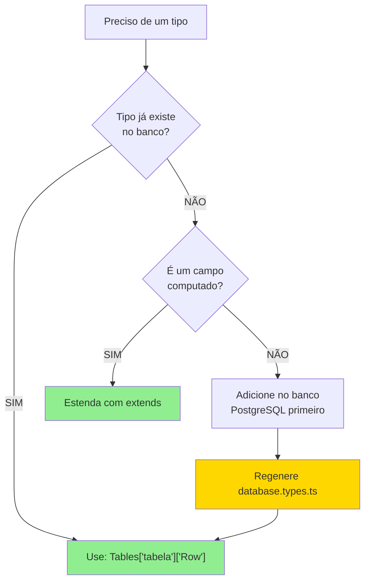

# 📘 Guia de Tipos no Versix Norma

## 🎯 Princípio Fundamental

**A fonte de verdade é SEMPRE o banco de dados PostgreSQL.**

O arquivo `packages/shared/database.types.ts` é **auto-gerado** pelo Supabase e contém o schema 100% sincronizado. Ele **nunca deve ser editado manualmente**.

---

## ✅ Como Usar Tipos Corretamente

### Padrão 1: Usar Tipos Diretamente do Banco

```typescript
// ✅ CORRETO
import { Tables } from '@versix/shared/database.types';

// Tipo da tabela 'usuarios'
type Usuario = Tables['usuarios']['Row'];

// Tipo da tabela 'lancamentos_financeiros'
type Lancamento = Tables['lancamentos_financeiros']['Row'];

// Usar em uma função
function processar(usuario: Usuario) {
  console.log(usuario.id, usuario.email);
}
```

**Quando usar:** 90% dos casos - quando você precisa de um tipo que já existe no banco.

---

### Padrão 2: Estender Tipos com Campos Computados

```typescript
// ✅ CORRETO - Estender para adicionar campos calculados
import { Tables } from '@versix/shared/database.types';

type UsuarioRow = Tables['usuarios']['Row'];

export interface UsuarioComAvatar extends UsuarioRow {
  avatar_url?: string; // ← Campo computado/calculado
  full_name?: string; // ← Campo derivado
  is_admin?: boolean; // ← Flag computada
}
```

**Quando usar:** Quando você precisa adicionar dados que não estão no banco (joins, computados, flags).

**Exemplo real:**

```typescript
type LancamentoRow = Tables['lancamentos_financeiros']['Row'];

export interface LancamentoComDetalhes extends LancamentoRow {
  categoria?: { nome: string; cor: string }; // ← Dados do JOIN
  conta?: { nome_exibicao: string }; // ← Dados do JOIN
  saldo_pendente?: number; // ← Computado
}
```

---

### Padrão 3: Criar Tipos Auxiliares (Sem Duplicação)

```typescript
// ✅ CORRETO - Tipo auxiliar que NÃO duplica banco
import { Tables } from '@versix/shared/database.types';

type UsuarioRow = Tables['usuarios']['Row'];

export type UsuarioId = UsuarioRow['id'];
export type UsuarioEmail = UsuarioRow['email'];

export interface UsuarioComMetadados extends UsuarioRow {
  metadata?: {
    last_login: Date;
    login_count: number;
  };
}
```

---

## ❌ O Que NUNCA Fazer

### ❌ ERRADO: Recriar Tipos Manualmente

```typescript
// ❌ NUNCA FAÇA ISSO!
export interface Usuario {
  id: string;
  email: string;
  nome: string;
  role: 'admin' | 'usuario';
  created_at: string;
  updated_at: string;
  // ... mais 50 campos para manter manualmente
}
```

**Por quê?**

- Você tem que manter 50 campos manualmente
- Se o banco muda, você não sabe que o tipo está errado
- TypeScript NÃO avisa que o tipo desincronizou
- Causa falhas de build no Vercel

---

### ❌ ERRADO: Usar Nomes Diferentes do Banco

```typescript
// ❌ NUNCA FAÇA ISSO!
export interface LancamentoFinanceiro {
  fornecedor_nome: string; // ← Banco tem: fornecedor
  data_vencimento: string; // ← Banco tem: data_lancamento
  comprovantes_array: any[]; // ← Banco tem: comprovantes (Json)
}
```

---

### ❌ ERRADO: Adicionar Campos Que Não Existem

```typescript
// ❌ NUNCA FAÇA ISSO!
export interface Transacao {
  id: string;
  valor: number;
  banco_origem: string; // ← Campo inexistente no banco!
  codigo_transacao: string; // ← Campo inexistente no banco!
}
```

---

## 📋 Fluxo de Trabalho

### Quando Você Precisa de Um Tipo



---

## 🔄 Quando o Banco Muda

### Passo 1: Criar Migration

```bash
# Criar migration de schema
npx supabase migration new add_user_phone_field
```

### Passo 2: Editar a Migration

```sql
-- supabase/migrations/20240101_add_user_phone_field.sql
ALTER TABLE usuarios ADD COLUMN phone VARCHAR(20);
```

### Passo 3: Deploy da Migration

```bash
# Aplicar a migration localmente
npx supabase db push

# Ou via Supabase Dashboard
```

### Passo 4: Regenerar Types ⚠️ IMPORTANTE

```bash
# Regenerar os tipos do banco
npx supabase gen types typescript --local > packages/shared/database.types.ts
```

### Passo 5: TypeScript Avisa Automaticamente

```typescript
// Antes da migration:
type Usuario = Tables['usuarios']['Row'];
const user: Usuario = { id: '1', email: 'test@test.com' };

// Depois da migration e regen:
// TypeScript AVISA: "Property 'phone' is missing"
// Você é forçado a lidar com o novo campo
```

---

## 🚨 Checklist para Desenvolvedores

Antes de fazer commit, verifique:

- [ ] Não criei nenhuma interface que duplica campos do banco?
- [ ] Todos os campos que usei existem no schema PostgreSQL?
- [ ] Se estendi um tipo, é para adicionar computados apenas?
- [ ] Se mudei o banco, regenerei `database.types.ts`?
- [ ] O build local passa sem erros de tipo?
- [ ] Não tenho `any` types sem necessidade?

---

## 📚 Exemplos Práticos

### Exemplo 1: Buscar e Retornar Usuário

```typescript
// ✅ CORRETO
import { Tables } from '@versix/shared/database.types';
import { supabase } from '@/lib/supabase';

async function getUser(id: string) {
  const { data, error } = await supabase.from('usuarios').select('*').eq('id', id).single();

  if (error) throw error;

  // data é do tipo Tables['usuarios']['Row']
  return data;
}

// Uso:
const user = await getUser('123');
console.log(user.email); // ✅ TypeScript sabe que existe
console.log(user.telefone_inexistente); // ❌ TypeScript reclama
```

---

### Exemplo 2: Buscar com Joins

```typescript
// ✅ CORRETO - Estender para dados de JOIN
import { Tables } from '@versix/shared/database.types';

type LancamentoRow = Tables['lancamentos_financeiros']['Row'];
type CategoriaRow = Tables['categorias_financeiras']['Row'];

export interface LancamentoComCategoria extends LancamentoRow {
  categoria?: CategoriaRow; // ← Dados do JOIN
}

async function getLancamentoComCategoria(id: string) {
  const { data, error } = await supabase
    .from('lancamentos_financeiros')
    .select(
      `
      *,
      categoria:categoria_id(*)
    `
    )
    .eq('id', id)
    .single();

  if (error) throw error;

  // Agora você sabe que tem categoria
  const lancamento: LancamentoComCategoria = data;
  console.log(lancamento.categoria?.nome);
}
```

---

### Exemplo 3: Criar Novo Registro

```typescript
// ✅ CORRETO - Usar Insert type do Supabase
import { Tables } from '@versix/shared/database.types';

async function createUser(data: Tables['usuarios']['Insert']) {
  return supabase.from('usuarios').insert(data).select().single();
}

// Uso:
createUser({
  email: 'novo@test.com',
  nome: 'Novo User',
  // ✅ TypeScript avisa campos obrigatórios
  // ❌ TypeScript reclama se campo não existir
});
```

---

## 🛡️ Proteções Automáticas

### TypeScript Strict Mode

O projeto tem `tsconfig.json` com strict mode ativado:

```json
{
  "compilerOptions": {
    "strict": true,
    "noImplicitAny": true,
    "strictNullChecks": true,
    "strictFunctionTypes": true
  }
}
```

Isso significa:

- ✅ Tipos `any` são detectados
- ✅ Campos obrigatórios são forçados
- ✅ Null/undefined são verificados
- ✅ Funções têm tipos claros

### Build Local vs Vercel

```
┌─────────────────────────────────────┐
│ Seu PC (pnpm build)                 │
│ ✅ TypeScript verifica tipos        │
│ ✅ Erro local = erro detectado      │
└──────────┬──────────────────────────┘
           │
           ├─→ ❌ PARA AQUI (não faz commit)
           │
           └─→ ✅ SEGUE para git
               │
               ├─→ GitHub Actions (CI/CD)
               │   ✅ TypeScript verifica novamente
               │
               └─→ Vercel Build
                   ✅ Build final antes de deploy
```

**Se seu build local passa, Vercel também passa.**

---

## 📞 Dúvidas Frequentes

### P: Posso criar um tipo que estenda `Tables['usuarios']['Row']` com um campo novo?

**R:** Sim, se for um campo **computado** (não no banco):

```typescript
// ✅ CORRETO - Campo computado
export interface UsuarioComFullName extends Tables['usuarios']['Row'] {
  full_name: string;  // Campo calculado, não no banco
}

// ❌ ERRADO - Campo que "parece" estar no banco
export interface UsuarioComTelefone extends Tables['usuarios']['Row'] {
  telefone: string;   // Se está no banco, use Tables['usuarios']['Row'] direto
}
```

---

### P: Tenho um tipo customizado que não é exatamente um Row da tabela. Devo criar?

**R:** Crie, mas deixe claro que é computado/auxiliar:

```typescript
// ✅ OK - Tipo auxiliar para lógica específica
export interface UsuarioParaAPI extends Tables['usuarios']['Row'] {
  token_acesso?: string;     // Adicionado antes de enviar para API
  senha_temporaria?: string; // Adicionado antes de enviar email
}
```

---

### P: E se o banco não tiver o tipo que preciso?

**R:** Adicione primeiro no banco via migration:

```sql
-- 1. Criar a coluna
ALTER TABLE usuarios ADD COLUMN telefone VARCHAR(20);

-- 2. Regenerar types
npx supabase gen types typescript --local > packages/shared/database.types.ts

-- 3. Usar no código
type Usuario = Tables['usuarios']['Row'];
const user: Usuario = { ..., telefone: '11999999999' };
```

---

## 🎓 Resumo das Regras

| Situação             | Use                               | Exemplo                                  |
| -------------------- | --------------------------------- | ---------------------------------------- |
| Tipo direto do banco | `Tables['tabela']['Row']`         | `Tables['usuarios']['Row']`              |
| Adicionar computed   | `interface X extends Tables[...]` | `interface UsuarioComAvatar extends ...` |
| Tipo Insert          | `Tables['tabela']['Insert']`      | Para criar registros                     |
| Tipo Update          | `Tables['tabela']['Update']`      | Para atualizar registros                 |
| Novo campo no banco  | Crie migration + regen types      | `ALTER TABLE ...`                        |
| Campo que não existe | ❌ NÃO USE                        | Vai dar erro no Vercel                   |

---

## 🔗 Referências

- **database.types.ts:** [packages/shared/database.types.ts](packages/shared/database.types.ts)
- **Supabase Docs:** https://supabase.com/docs/reference/javascript/select
- **TypeScript Handbook:** https://www.typescriptlang.org/docs/

---

**Última atualização:** Janeiro 2026
**Status:** ✅ Em vigência
**Responsável:** Arquitetura do Projeto
